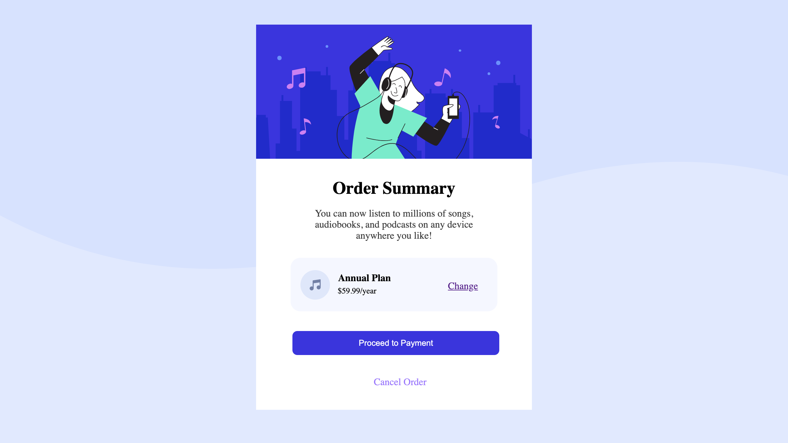

This is a solution to the [Order summary card challenge on Frontend Mentor](https://www.frontendmentor.io/challenges/order-summary-component-QlPmajDUj).

## Table of contents

- [Overview](#overview)
  - [Screenshot](#screenshot)
  - [Links](#links)
- [My process](#my-process)
  - [Built with](#built-with)
  - [What I learned](#what-i-learned)

## Overview

### The challenge

Users should be able to:

- See hover states for interactive elements

### Screenshot

### Links

## My process

### Built with

- Semantic HTML5 markup
- CSS custom properties

### What I learned

How to take basic design files made by someone else and make a functioning landing page for a product order. How to interprate others ideas and bring them to life including hover states. 
